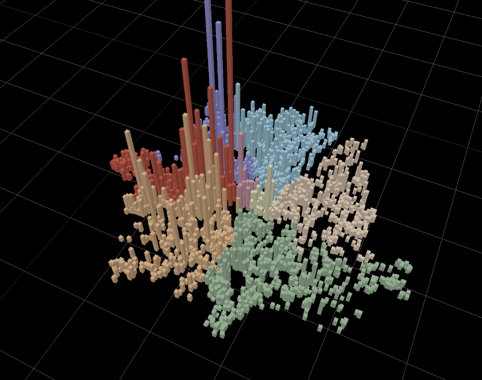

# Zoop Visual

This project was created to visualise London property sale data in a more compelling way, as well as a fun way to learn the basics of Three.js.

The project is composed of a web scraper to fetch property sale data in London postcodes, an SQLite database to dump the data into, a python API to serve up data to the frontend, and a Three.js  powered frontend to visualise the data in a 3D space. 

The project aims to display the map of London as a grid of cubes, with the mean sale price in that area being represented by the cube height. I plan to add controls for filtering data by number of bedrooms, focusing on certain areas, and others. 

## Project structure

This project is structured into several parts:
 - A web-scraper written in Python, under `python/web_scraper/`.
 - A fastapi service run under `api/`.
 - A frontend utilising three.js, under `threejs/price_visualiser/`.
 - The scraped data is stored in a SQLite db, under `/db`.
 - Custom one-off migrations for the database, for tasks that require python logic (i.e. cannot be performed easily in SQL). Found under `python/data_migrations`.

## Backend
(Commands utilise the Makefile under `python/Makefile`)

Both the web scraper and api share common logic, so are contained within the same `python/` directory and have the same dependencies. 

To initialise the project, first create a venv with make `init-venv`. After activating the venv, install with `make install`.

### Web Scraper
The web scraper performs 2 actions - looping over a number of websites to scrape property sale data from, then inserting the returned records into the database for storage.

An interface is used for each different website to scrape (such as Rightmove, Zoopla, etc.). This is declared under `python/web_scraper/scrapers/base.py`. New scrapers can be created in this directory and included in the initialisation under `python/web_scraper/main.py`. 

### API
The API uses fastapi, and exists to provide data to the frontend in a custom, simplified form. The service can be started with `make run-api`, and provides endpoints on `http://localhost:8000/`. 

### Database
The SQLite db stores all the scraped property sale data in a unified format. 
The current state of the database is committed to the repo for now as `db/zoop.db`, since the file is still small.

Migrations can be found under `db/migrations/`. Running these SQL files in order will initialise a valid empty db, ready to run the web scraper.

## Frontend

Install requirements with `npm install`.

To start the frontend with auto-reload, use `npm run dev` and open `http://localhost:5173/` in a browser.
